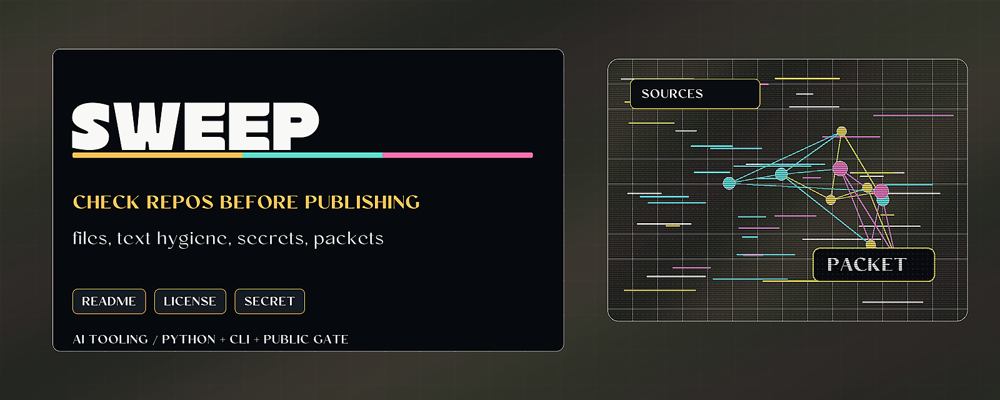

# Public Surface Sweeper



> Check a repository's public surface before publishing or asking for trust.

Public Surface Sweeper is a pre-release hygiene CLI for required files,
public-facing text, and secret-shaped values. It can also emit proof-surface
packets so release checks can feed the larger evidence workflow.

## Why it matters

Small public repos often fail on simple delivery details: missing license,
unclear README, accidental credential-shaped strings, or unreviewed release
claims. This tool makes those checks quick and repeatable.

## Try it

```bash
python -m pip install -e ".[test]"
public-surface-sweeper examples/clean-repo
python -m pytest
```

## What to test first

- Run the clean fixture and expect `No findings.`
- Run `public-surface-sweeper . --summary`.
- Emit a proof packet with `--proof-packet`.

## Current status

Python package and CLI. It checks public repo hygiene and secret-shaped values;
it is not a full security scanner.

## Existing technical notes

> Pre-release repo-hygiene CLI: required-file checks and secret-shape detection. Hygiene, not a vuln scanner.

[](LICENSE)


[](https://github.com/HarperZ9/public-surface-sweeper/actions/workflows/ci.yml)
[](https://harperz9.github.io)

Use it before a repository asks a user, customer, reviewer, investor, or future
maintainer to trust what it says.

It is intentionally narrow: a release-hygiene gate, not a full security scanner
or certification tool.

## Install

```bash
python -m pip install public-surface-sweeper
```

For local development:

```bash
python -m pip install -e ".[test]"
python -m pytest
```

## Usage

See [USAGE.md](USAGE.md) for an install line, the full CLI and Python API,
worked examples, and expected output.

```bash
public-surface-sweeper .
public-surface-sweeper . --json
public-surface-sweeper . --summary
public-surface-sweeper . --summary --json
public-surface-sweeper . --proof-packet
public-surface-sweeper . --fail-on warning
```

The command exits with status `1` when error-level findings are present.

Use `--fail-on warning` to fail on warnings and errors, or `--fail-on none` to
print findings without failing the process.

Run the bundled clean fixture:

```bash
public-surface-sweeper examples/clean-repo
```

Expected output:

```text
No findings.
```

## What it checks

Required project files:

- `README.md`
- `LICENSE`
- `AUTHORS.md`
- `CONTRIBUTING.md`

Text hygiene:

- em dash characters in public-facing text

Secret-shaped values:

- private key block markers
- GitHub token shaped values
- OpenAI key shaped values
- AWS access key shaped values
- Slack token shaped values
- generic credential assignments such as `token: <value>`, `api_key=<value>`,
  `client_secret=<value>`, and `password=<value>` when the value is not an
  obvious placeholder

The scanner skips common cache, build, virtualenv, and dependency directories.
It also skips binary files and text files larger than 1 MB.
Secret-shaped labels and placeholders such as `YOUR_API_KEY_HERE`, `redacted`,
or `example-token-placeholder` are ignored so findings stay value-focused.

## Example text output

```text
ERROR LICENSE required-file: missing required file: LICENSE
ERROR README.md:12 em-dash: replace em dash with plain punctuation
```

## Example JSON output

```json
[
  {
    "path": "LICENSE",
    "line": 0,
    "rule": "required-file",
    "severity": "error",
    "message": "missing required file: LICENSE"
  }
]
```

## Example summary output

```text
score: 75
status: blocked
total_findings: 1
errors: 1
warnings: 0
action_items:
- LICENSE: missing required file: LICENSE
```

Summary mode is the fastest handoff format for release reviews. It gives a
bounded readiness score, a status, finding counts, and the first actionable
items to fix before publishing or showing the repository to a reviewer.

## Proof-surface packet output

Use `--proof-packet` when the scan result should feed `repo-proof-index` or a
release-readiness report. The packet follows the shared proof-surface interop
shape: claims, checks, and action items in one JSON object. The generated packet
is self-checked before printing so producer drift fails before entering the
pipeline.

```bash
public-surface-sweeper . --proof-packet > public-surface.packet.json
repo-proof-index public-surface.packet.json --summary
```

## What it does not do

- It does not perform exploit testing.
- It does not audit dependencies for vulnerabilities.
- It does not validate whether a credential is real.
- It does not certify that a repository is safe, compliant, or trustworthy.
- It does not replace a security review.

## Release-readiness use

`public-surface-sweeper` is the first point in a proof-surface pipeline:

```text
repo public surface -> hygiene findings -> proof index -> release-readiness report
```

Its job is to catch basic public-surface defects before a repository asks users,
clients, employers, or reviewers to trust it.

---
**Zain Dana Harper** — small tools with explicit edges.
[Portfolio](https://harperz9.github.io) · [HarperZ9](https://github.com/HarperZ9)
<sub>Built with Claude Code; reviewed, tested, and owned by me.</sub>
