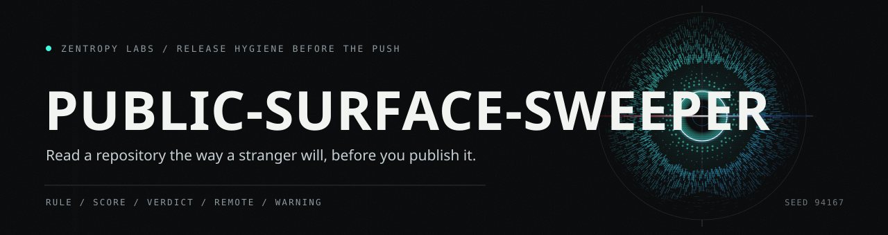

<p align="center"></p>

# Public Surface Sweeper

> Check a repository's public surface before publishing or asking for trust.

Public Surface Sweeper audits public and developer delivery surfaces for
GitHub-facing repositories. It checks whether a repo explains itself clearly,
has runnable handoff material, carries release/status metadata, avoids
secret-shaped values, and can feed proof-surface evidence workflows.

## Why it matters

Small public repos often fail on simple delivery details: missing license,
unclear README, accidental credential-shaped strings, or unreviewed release
claims. This tool makes those checks quick and repeatable.

## Try it

```bash
python -m pip install -e ".[test]"
public-surface-sweeper examples/clean-repo
python -m pytest
```

## What to test first

- Run the clean fixture and expect `No findings.`
- Run `public-surface-sweeper . --summary`.
- Emit a proof packet with `--proof-packet`.

## Current status

Python package and CLI. It checks public clarity, developer handoff material,
workspace-scale delivery drift, and secret-shaped values; it is not a full
security scanner or certification tool.

## Existing technical notes

> Audit public and developer delivery surfaces before a repository asks for trust.

[](LICENSE)


[](https://github.com/HarperZ9/public-surface-sweeper/actions/workflows/ci.yml)
[](https://harperz9.github.io)

Use it before a repository asks a user, customer, reviewer, investor, or future
maintainer to trust what it says.

It is intentionally narrow: a release-hygiene gate, not a full security scanner
or certification tool.

## Install

```bash
python -m pip install public-surface-sweeper
```

## For developers

For local development:

```bash
python -m pip install -e ".[test]"
python -m pytest
```

## Usage

See [USAGE.md](USAGE.md) for an install line, the full CLI and Python API,
worked examples, and expected output.

```bash
public-surface-sweeper .
public-surface-sweeper . --json
public-surface-sweeper . --summary
public-surface-sweeper . --summary --json
public-surface-sweeper . --proof-packet
public-surface-sweeper . --fail-on warning
public-surface-sweeper C:/dev/public --workspace --json
```

The command exits with status `1` when error-level findings are present.

Use `--fail-on warning` to fail on warnings and errors, or `--fail-on none` to
print findings without failing the process.

Run the bundled clean fixture:

```bash
public-surface-sweeper examples/clean-repo
```

Expected output:

```text
No findings.
```

Scan every GitHub-facing repository under a workspace root:

```bash
public-surface-sweeper C:/dev/public --workspace
```

Workspace mode discovers local repositories with GitHub remotes, deduplicates
multiple checkouts of the same remote, runs the single-repo sweep against each
one's forward-facing delivery surface, and emits a delivery matrix with
separate public, developer, and boundary verdicts. The matrix is public-safe by
default: it includes repository names, GitHub slugs, relative paths, scores,
counts, and action items, but not absolute local paths, raw secret values,
network calls, or filesystem writes.

## What it checks

A sweep walks one repository and applies every rule below to what it finds
on disk. The order matters at the end, where two filters remove candidate
findings that another rule has already accounted for.

![Eight stages of a single sweep: root, skip list, readable, punctuation, required, contract, credentials, filters. The walk starts at the repository root and covers everything under it. Twenty five directory names are never entered, among them the virtual environment, the build output and the caches. A file is read only if it decodes as UTF-8, holds no null byte, and is under a megabyte. An em dash anywhere in a scanned file is an error rather than a note. Four files have to be present at the root by name. Five further rules ask whether the release surface is inspectable at all: a changelog, funding metadata, agent instructions, usage docs and a workflow. Five known credential shapes are matched by their own patterns, then a generic name-equals-value rule catches the rest. Two filters drop candidates before they are counted: a span a provider rule already claimed, and a value that reads as a placeholder. Three outcomes: ready, needs polish, and blocked.](docs/art/sweep-lane.svg)

The workspace mode runs that same sweep across every GitHub-facing checkout
under a root, then reduces each repository to three verdicts and takes the
worst of them.

![Eight stages of the workspace matrix: walk, git config, remote, duplicates, surface, public, developer, status. Every directory under the given root is walked once, skipping the same build and cache names the single sweep skips. A repository is recognised by a readable git config file. Only a remote that parses as a GitHub slug is kept, so a local-only checkout is passed over. When two checkouts share a slug the shallower path wins, and a mirror directory loses on purpose. Each surviving repository is scanned across its named files, its workflows and its docs, rather than its whole tree. Six rules decide the public verdict. Four more decide the developer verdict. The overall status is the worst of the three verdicts rather than an average of them, so one drift is enough. Three outcomes: match, drift, and unverifiable.](docs/art/matrix-lane.svg)

Required project files:

- `README.md`
- `LICENSE`
- `AUTHORS.md`
- `CONTRIBUTING.md`

Text hygiene:

- em dash characters in public-facing text

README delivery:

- public value, status, or use-case section
- developer entry point and workflow section
- runnable command block
- substantive non-badge visual asset

Forward-facing repository delivery:

- changelog or release notes for public status
- GitHub funding metadata for sponsor-button support
- `AGENTS.md` or equivalent agent/developer instructions
- standalone `USAGE.md` or docs usage guide
- GitHub workflow evidence under `.github/workflows/`

Workspace delivery:

- GitHub-facing repository discovery from local `.git/config` remotes
- duplicate-checkout deduplication by GitHub remote
- local wrapper repository traversal for workspaces that contain nested repos
- fast delivery-surface scanning instead of full source-tree scanning
- public/developer delivery verdicts per repository
- normalized contract rules for receipt chains and dashboards
- release-readiness counts across a whole local portfolio
- JSON output suitable for receipt chains and dashboard ingestion

Secret-shaped values:

- private key block markers
- GitHub token shaped values
- OpenAI key shaped values
- AWS access key shaped values
- Slack token shaped values
- generic credential assignments such as `token: <value>`, `api_key=<value>`,
  `client_secret=<value>`, and `password=<value>` when the value is not an
  obvious placeholder

![Ten of the rules a sweep applies, one to a row, each with its severity and what it had to read. Five errors cover missing required files, an em dash, a PEM private key header, a GitHub token prefix, and an AWS access key identifier. Four warnings cover a README without a substantive image, a README without all three developer entry points, absent funding metadata, and an absent workflow file. The generic credential assignment row is accented, because it is the one rule whose match can still be dropped: by a provider rule that already claimed the same span, or by a value that reads as a placeholder.](docs/art/rule-severity.svg)

The scanner skips common cache, build, virtualenv, dependency, and local
agent-tool state directories such as `.superpowers` and `.telos`.
It also skips binary files and text files larger than 1 MB.
Secret-shaped labels and placeholders such as `YOUR_API_KEY_HERE`, `redacted`,
or `example-token-placeholder` are ignored so findings stay value-focused.
Delivery findings are warning-level by default so existing repos can be migrated
without blocking secret and required-file gates.

## Example text output

```text
ERROR LICENSE required-file: missing required file: LICENSE
ERROR README.md:12 em-dash: replace em dash with plain punctuation
```

## Example JSON output

```json
[
  {
    "path": "LICENSE",
    "line": 0,
    "rule": "required-file",
    "severity": "error",
    "message": "missing required file: LICENSE"
  }
]
```

## Example summary output

```text
score: 75
status: blocked
total_findings: 1
errors: 1
warnings: 0
action_items:
- LICENSE: missing required file: LICENSE
```

Summary mode is the fastest handoff format for release reviews. It gives a
bounded readiness score, a status, finding counts, and the first actionable
items to fix before publishing or showing the repository to a reviewer.

## Proof-surface packet output

Use `--proof-packet` when the scan result should feed `repo-proof-index` or a
release-readiness report. The packet follows the shared proof-surface interop
shape: claims, checks, and action items in one JSON object. The generated packet
is self-checked before printing so producer drift fails before entering the
pipeline.

```bash
public-surface-sweeper . --proof-packet > public-surface.packet.json
repo-proof-index public-surface.packet.json --summary
```

## What it does not do

- It does not perform exploit testing.
- It does not audit dependencies for vulnerabilities.
- It does not validate whether a credential is real.
- It does not certify that a repository is safe, compliant, or trustworthy.
- It does not replace a security review.

## Release-readiness use

`public-surface-sweeper` is the first point in a proof-surface pipeline:

```text
repo public surface -> hygiene findings -> proof index -> release-readiness report
```

Its job is to catch basic public-surface defects before a repository asks users,
clients, employers, or reviewers to trust it.

---
**Zain Dana Harper** - small tools with explicit edges.
[Portfolio](https://harperz9.github.io) · [HarperZ9](https://github.com/HarperZ9)
<sub>Built with Claude Code; reviewed, tested, and owned by me.</sub>

---

**[Zentropy Labs](https://github.com/ZentropyLabs-ai)** · order out of entropy. An independent lab building evidence-first tools that leave a re-checkable artifact behind. Built by Zain Dana Harper in Seattle. The full workbench is at [Project Telos](https://harperz9.github.io).
